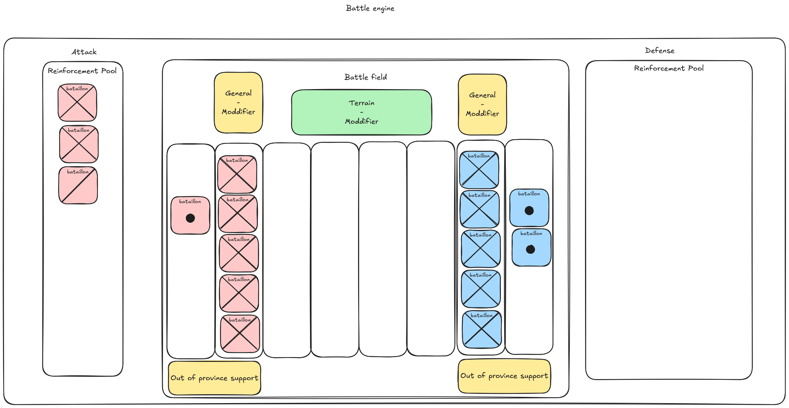

# Land Battle

**Core Design**

A battle consist of 2 ellements, a 2D grid representing the battlefield and one pool of reinforcement by side

The size of the grid is determined by the battalion with the greatest range along the X-axis (which may be reduced by terrain) and by the terrain frontage along the Y-axis.

At the start of a battle, infantry and cavalry battalions occupy the front line up to the terrain frontage, while artillery units do the same but remain one tile behind.

If their is Unit left, they join the reinforcement pool

**Each turn of a batallion have 2 phases**

*   1)Movement phase
*   2)Fire or Assault Phase

The first batallion to act is the one with the higher initiative (advantage to attack if equality)

If a bataillon have no enemy in range, it advance of speed value in the array.  
If an enemy is in range, the bataillon fire.  
If not, it's turn stop and an other bataillon is picked.

In the longer term, the objective is, to have bataillon that stop/advance at the right range, massive charge all together when ordered, withdraw if needed.

## Turn

## Formula

**Hits:**  
Each side rolls their pool. Hits occur when an attack die beats a defence die. If one of the die is a 1 and the other one a 6 it's a crit

| Era | Base Hit on | Ex: |
| --- | --- | --- |
| Napoleonic (muskets) | less damage with distance | Inaccurate smoothbores |
| Industrial (rifles) | more damage with distance | More accurate rifling |
| Steampunk WW2 | more attack roll  | increased firePower |

**Calculating Casualties**  
After net hits are determined: Casualties = Net Hits × ((Manpower/Max Manpower) × Firepower × (Organisation/ Max Organisation)) Napoleonic lethality: 0.002 (few % per day)

**Dead vs Wounded**  
To figure out... simple split ?  
⅓ dead ⅔ wounded Wounded should create less war weariness than dead.  
But wounded that dies while in army create more than combat death ?

**Morale & Organization Impact**  
Stress proportional to casualties and hits taken.  
Schock should de-org and demoralize more  
Experiance and discipline should negate de org and moral losses or just bigger pool  
Morale loss = ?  
ORG loss = ?  
At the beggening artillery should mostly deorganise and demoralize  
But with technology it should get more and more lethal.

**Criticals & Misses**  
Critical Hit: Inflicts more casualties, may trigger morale shock. Critical Miss: Causes confusion, lose 1 attack die next round and org.

**Movement and Ranges** Each brigade occupies a “position” (distance from enemy). Ranged units fire if enemy ≤ range. Non-firing units advance at their Speed (distance units per turn). If distance = 0 → melee assault phase (use Assault Power stat).

If support on frontline, malus, -80% ?
  

**Hand to hand combat:** Unit deal damage to each other at the same time ?

**Reinforcement**  
The reinforcement is based on initiative  
Every time a bataillon whant to pass from reinforcement pool to batlefield, it have to throw a dice.  
First a 10 dice, every turn it try to enter the batlefield, the max dice value is -1 If dice is smaller or equal to initiative it enter the batlefield.  
Bataillon join the battle field at front line

**Note:**  
High chance for reinforcement to be :  
First Cavalery  
Then skirmisher  
then infantry  
then artilery  
**Works well for encounter battle or ambush but not for preapered position/battle**

idea for later 

### Formation:
With higher firepower infantery doesn't move the same way it used to.
Addaptation 

| Formation | Density (FD) | Firepower | Defense | Description |
| --- | --- | --- | --- | --- |
| **Line / Massed** | 1.25 | +20% firepower | ×1.25 damage taken | Napoleonic linear volleys — deadly but fragile |
| **Loose / Standard** | 1.0 | baseline | baseline | Mid-19th century formations |
| **Dispersed / Skirmish** | 0.75 | −15% firepower | ×0.75 damage taken | WW1/WW2 infantry dispersion |
| **Entrenched / Defensive** | 0.5 | −30% firepower | ×0.5 damage taken | Units dug in, behind cover or trenches |
| **Assault / Close Order** | 1.5 | +30% assault | ×1.5 damage taken | Shock troops, melee formations |

  
### Entranchmant and tactics
| Tactical Posture | Firepower | Damage Taken | Speed | Morale |
| --- | --- | --- | --- | --- |
| **Defend (entrench)** | −30% | ×0.5 | −   | +10% |
| **Hold (standard)** | baseline | baseline | baseline | baseline |
| **Advance cautiously** | −10% | ×0.8 | −10% | baseline |
| **Assault (close order)** | +30% | ×1.5 | +10% | +10% |
| **Skirmish (dispersed)** | −15% | ×0.75 | +10% | −5% |
